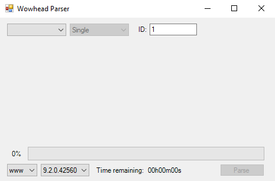
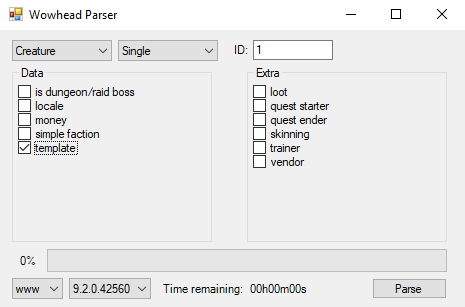

# WowheadParser for TrinityCore
Extracts, parses and outputs SQL information from Wowhead by a single ID, range of IDs or a zone.

## Current Support
Unchecked box means the option might be incomplete and/or broken. Eventually all the options below will be checked:

- [ ] Black Market
- [x] Creature
- [x] Gameobject
- [x] Item
- [x] Quest
- [ ] Zone

The supported WoW versions are:

- 7.3.5.26972 (Legion)
- 8.0.1.28153 (BFA)
- 9.2.0.42560 (SL)

## Screenshots
Design is not final *(is it ever?)*.

